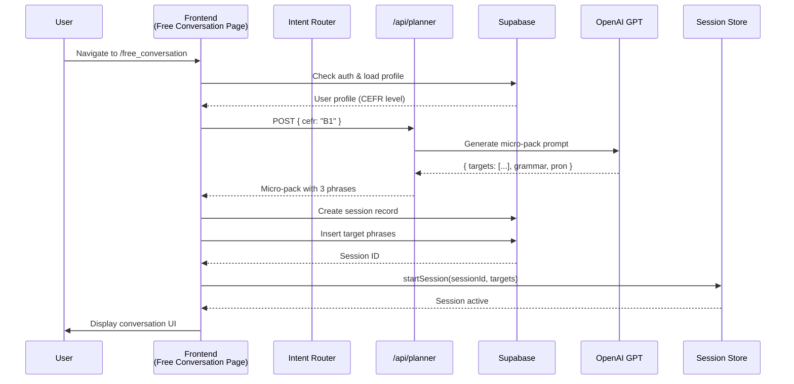
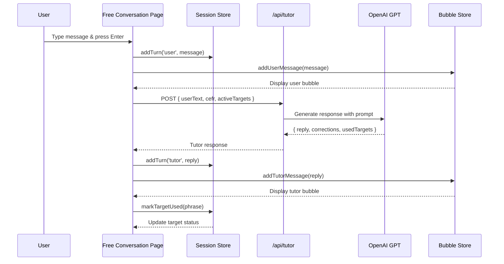
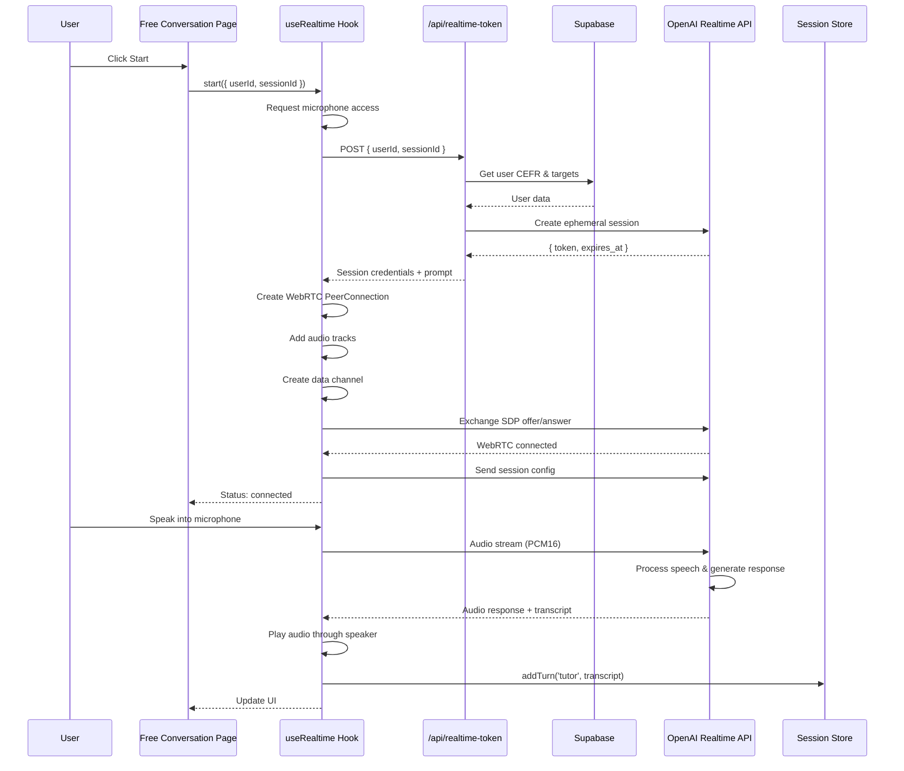
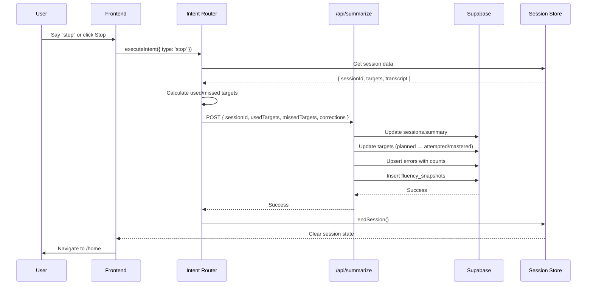
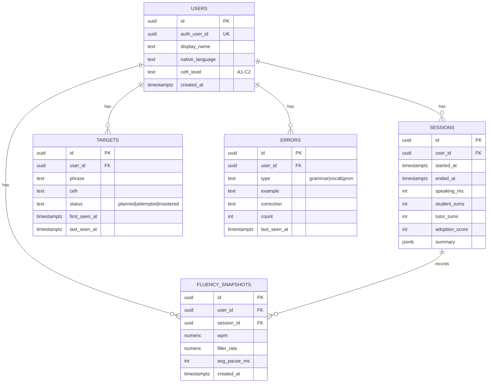
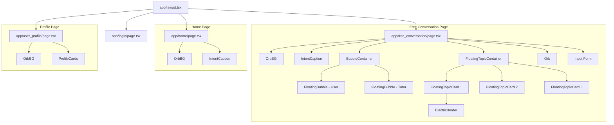
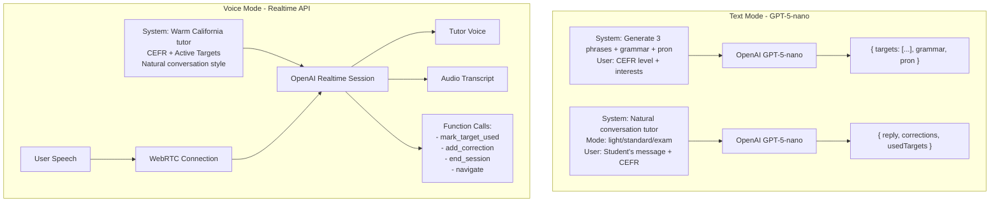
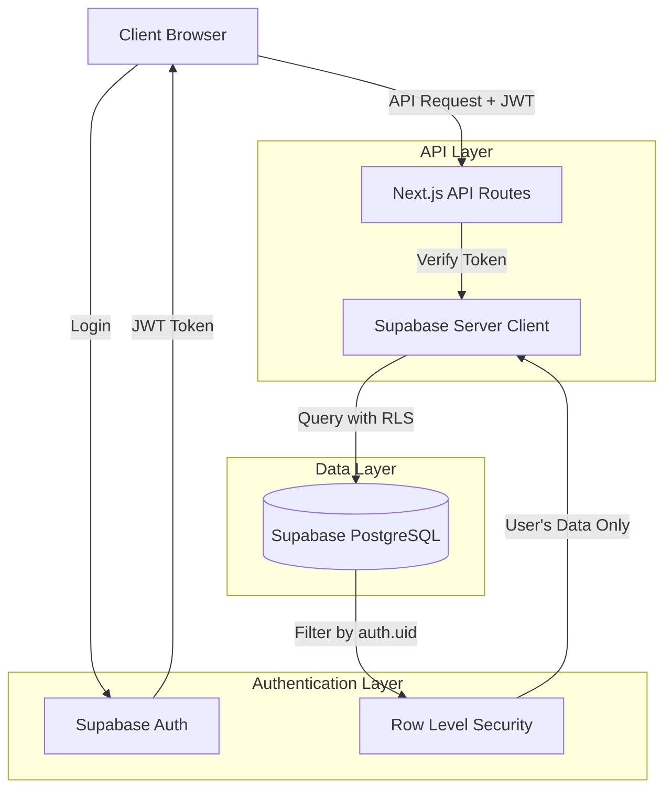

# Stella - AI English Tutor Architecture

## System Overview

Stella is a Next.js-based AI English tutor that helps Japanese learners practice English conversation through both text and voice interfaces. The system uses OpenAI's GPT models for text-based tutoring and Realtime API for voice interactions.

## High-Level Architecture

```mermaid
graph TB
    subgraph "Frontend - Next.js App Router"
        Login[Login Page]
        Home[Home Page]
        FreeConv[Free Conversation Page]
        Profile[User Profile Page]

        subgraph "UI Components"
            OrbBG[OrbBG - Background]
            Orb[Orb - Visual Avatar]
            BubbleContainer[BubbleContainer - Messages]
            FloatingBubble[FloatingBubble - Message Bubbles]
            FloatingTopicCard[FloatingTopicCard - Topic Suggestions]
            IntentCaption[IntentCaption - Command Display]
            TargetsPanel[TargetsPanel - Phrase Goals]
            TranscriptPane[TranscriptPane - Chat History]
            ProfileCards[ProfileCards - Stats Display]
            SpotlightCard[SpotlightCard - Glass Effect Container]
        end

        subgraph "State Management - Zustand"
            SessionStore[sessionStore - Session State]
            BubbleStore[bubbleStore - UI State]
        end

        subgraph "Hooks & Utilities"
            UseRealtime[useRealtime - WebRTC Manager]
            IntentRouter[intentRouter - Command Parser]
        end
    end

    subgraph "Backend - API Routes"
        PlannerAPI[/api/planner - Generate Micro-Pack]
        TutorAPI[/api/tutor - Text Tutoring]
        SummarizeAPI[/api/summarize - Session Summary]
        RealtimeTokenAPI[/api/realtime-token - WebRTC Token]
        RealtimeSessionAPI[/api/realtime-session - Session Config]
    end

    subgraph "External Services"
        OpenAIText[OpenAI GPT-5-nano - Text]
        OpenAIRealtime[OpenAI Realtime API - Voice]
        Supabase[(Supabase PostgreSQL)]
        SupabaseAuth[Supabase Auth]
    end

    FreeConv --> UseRealtime
    FreeConv --> BubbleContainer
    FreeConv --> Orb
    FreeConv --> FloatingTopicCard

    UseRealtime --> RealtimeTokenAPI
    UseRealtime --> OpenAIRealtime

    Home --> IntentRouter
    FreeConv --> IntentRouter

    IntentRouter --> PlannerAPI
    IntentRouter --> SummarizeAPI

    BubbleContainer --> FloatingBubble

    PlannerAPI --> OpenAIText
    TutorAPI --> OpenAIText

    PlannerAPI --> Supabase
    SummarizeAPI --> Supabase
    RealtimeTokenAPI --> Supabase

    Login --> SupabaseAuth
    Profile --> Supabase

    SessionStore <--> FreeConv
    BubbleStore <--> BubbleContainer
```

## Data Flow Architecture

### 1. Session Start Flow



### 2. Text Conversation Flow



### 3. Voice Conversation Flow (Realtime API)



### 4. Session End Flow



## Database Schema



## Component Hierarchy



## State Management Architecture

```mermaid
graph LR
    subgraph "Session Store (Zustand)"
        User[user: UserProfile]
        SessionId[sessionId: string]
        Transcript[transcript: TranscriptTurn[]]
        ActiveTargets[activeTargets: TargetStatus[]]
        Stats[stats: SessionStats]
        VoiceMode[isVoiceMode: boolean]
        Intent[currentIntent: string]
    end

    subgraph "Bubble Store (Zustand)"
        Bubbles[bubbles: Bubble[]]
        ShowTranscript[showTutorTranscript: boolean]
    end

    subgraph "Actions"
        StartSession[startSession]
        EndSession[endSession]
        AddTurn[addTurn]
        MarkTarget[markTargetUsed]
        AddUserMsg[addUserMessage]
        AddTutorMsg[addTutorMessage]
    end

    FreeConv2[Free Conversation Page] --> StartSession
    FreeConv2 --> AddTurn
    FreeConv2 --> AddUserMsg

    StartSession --> SessionId
    StartSession --> ActiveTargets
    AddTurn --> Transcript
    AddUserMsg --> Bubbles
```

## AI Integration Architecture



## Technology Stack

### Frontend
- **Framework**: Next.js 14+ (App Router)
- **Language**: TypeScript
- **Styling**: TailwindCSS
- **State Management**: Zustand
- **UI Components**: Custom components with glass morphism effects
- **Audio**: Web Audio API + WebRTC

### Backend
- **Runtime**: Node.js (Next.js API Routes)
- **Authentication**: Supabase Auth
- **Database**: Supabase (PostgreSQL)
- **AI Models**:
  - OpenAI GPT-5-nano (text)
  - OpenAI Realtime API (voice)

### Infrastructure
- **Hosting**: Vercel (recommended)
- **Database**: Supabase (PostgreSQL with RLS)
- **Real-time Communication**: WebRTC + OpenAI Realtime API

## Security Architecture



### RLS Policies
- Users can only view/insert/update their own records
- All tables have policies matching `auth.uid()` to `users.auth_user_id`
- Server-side validation ensures no data leakage

## File Structure

```
stella/
├── app/
│   ├── layout.tsx              # Root layout
│   ├── page.tsx                # Landing page
│   ├── login/page.tsx          # Auth page
│   ├── home/page.tsx           # Dashboard
│   ├── free_conversation/      # Main conversation UI
│   │   └── page.tsx
│   ├── user_profile/           # User stats & settings
│   │   └── page.tsx
│   └── api/
│       ├── planner/route.ts    # Generate micro-pack
│       ├── tutor/route.ts      # Text tutoring
│       ├── summarize/route.ts  # Session summary
│       ├── realtime-token/     # WebRTC ephemeral token
│       │   └── route.ts
│       └── realtime-session/   # Session config
│           └── route.ts
├── components/
│   ├── OrbBG.tsx              # Background with orb effect
│   ├── Orb.tsx                # 3D orb avatar
│   ├── BubbleContainer.tsx    # Message display manager
│   ├── FloatingBubble.tsx     # Individual message bubble
│   ├── FloatingTopicCard.tsx  # Topic suggestion card
│   ├── FloatingTopicContainer.tsx
│   ├── IntentCaption.tsx      # Command feedback display
│   ├── TargetsPanel.tsx       # Phrase goals sidebar
│   ├── TranscriptPane.tsx     # Chat history
│   ├── ProfileCards.tsx       # User stats cards
│   ├── SpotlightCard.tsx      # Glass effect container
│   └── ElectricBorder.tsx     # Animated border effect
├── lib/
│   ├── aiContracts.ts         # TypeScript types for AI I/O
│   ├── schema.ts              # Zod validation schemas
│   ├── supabaseClient.ts      # Client-side Supabase
│   ├── supabaseServer.ts      # Server-side Supabase
│   ├── sessionStore.ts        # Zustand session state
│   ├── bubbleStore.ts         # Zustand UI state
│   ├── intentRouter.ts        # Command parser & executor
│   ├── useRealtime.ts         # WebRTC hook
│   ├── topicSuggestions.ts    # Topic generation logic
│   └── utils.ts               # Utility functions
└── sql/
    └── schema.sql             # Database schema + RLS policies
```

## Key Design Patterns

### 1. Intent-Driven Navigation
- Text or voice commands are parsed into intents
- Intent router handles execution uniformly
- Supports: start, stop, navigate, add_target

### 2. Dual-Mode Communication
- Text mode: Traditional request/response via /api/tutor
- Voice mode: Real-time bidirectional via WebRTC
- Both modes share the same state management

### 3. Optimistic UI Updates
- User messages appear immediately
- Background API calls update state
- Provides fast, responsive experience

### 4. Progressive Enhancement
- Core text functionality works without WebRTC
- Voice mode adds real-time capabilities
- Graceful fallback for unsupported browsers

### 5. Micro-Pack Learning
- AI generates 3 target phrases per session
- Phrases tracked through planned → attempted → mastered
- Spaced repetition through error tracking

## Performance Considerations

### Client-Side
- Zustand for minimal re-renders
- Component lazy loading
- Audio streaming (no buffering)
- Efficient WebRTC connection reuse

### Server-Side
- Edge functions for low latency (Vercel)
- Database indexes on user_id, status, session_id
- Ephemeral tokens (expire after use)
- Connection pooling via Supabase

### Database
- RLS policies use indexed columns
- JSONB for flexible summary storage
- Timestamps for temporal queries
- Cascade deletes for data integrity
